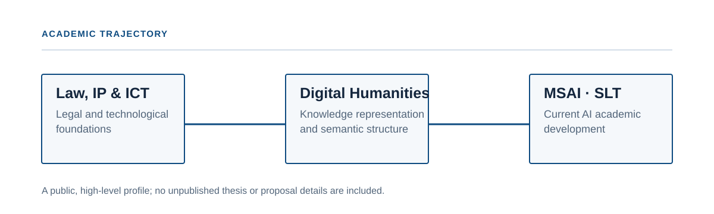
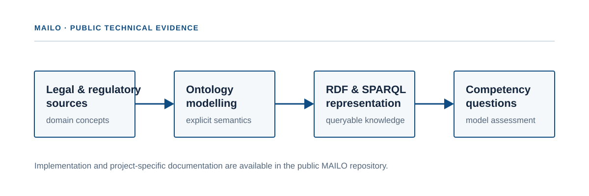

# Chang-Hua Kao (Victor)

**Applied AI & Knowledge Engineering · Legal AI · Knowledge Graphs · Reliable AI**

I work at the intersection of **AI engineering, knowledge representation, and complex regulated domains**. My background combines law and ICT, digital humanities, ontology/knowledge-graph engineering, and current study in artificial intelligence (Speech & Language Technology).

This public portfolio highlights projects that show how I move from domain requirements to structured knowledge, executable validation, API-backed applications, and user-facing tools.

<p align="center">
  
</p>

## Featured engineering work

### 1. [MAILO Legal AI Engine](https://github.com/vrkkao-eng/mailo-legal-ai-engine)

**Python research pipeline · knowledge engineering · validation**

A public Python package/CLI extracted from MAILO thesis tooling. It demonstrates an inspectable pipeline for supplied research findings, RDF/JSON-LD export, SPARQL execution, SHACL validation, reproducible reports, automated tests, and GitHub Actions CI.

**Evidence:** Python 3.11+ · RDFLib · pySHACL · SPARQL · JSON-LD · pytest · GitHub Actions · optional Anthropic tool loop

---

### 2. [MAILO — Medical AI Legal Ontology](https://github.com/vrkkao-eng/Mailo-ontology)

**Knowledge graph · OWL 2 · SHACL · EU medical-AI regulation**

MAILO is the canonical knowledge-model repository. It represents obligations and legal relationships across EU medical-AI regulation and links executable SHACL constraints to legal sources and CJEU case law.

<p align="center">
  
</p>

---

### 3. [NomadSpot Taiwan](https://github.com/vrkkao-eng/NomadSpot-Taiwan)

**Backend for Frontend · API integration · web deployment**

A four-person web project for discovering work-friendly cafés in Taiwan. My contribution focused on the application architecture and integration layer: frontend/backend server setup, the Express BFF, and external API integration.

**Evidence:** Node.js · Express · multi-source APIs · OAuth token caching · fallback handling · geospatial data · Vercel

---

### 4. [Venezuela Earthquake Companion Desk](https://github.com/vrkkao-eng/venezuela-earthquake-companion-desk)

**Offline-first decision-support prototype · constrained-system design**

A field-oriented prototype built around low-connectivity constraints. It explores compact building-record encoding, audio data transmission, tactical routing, satellite-pass calculations, and multilingual offline-first interaction.

**Evidence:** JavaScript · A* routing · codec/checksum design · AFSK · SGP4 · offline-first architecture

## Supporting work

- [AI & Data Protection thesis visualisation](https://github.com/vrkkao-eng/IpIct_MANAMA_Thesis_AI_Data_protection) — communicating AI regulation, GDPR and foundation-model issues through an interactive digital format.
- [Kelsen Authority Visualisation](https://github.com/vrkkao-eng/Kelsen-authority-visualization) — bilingual interactive presentation of a jurisprudence thesis and complex conceptual structures.

## How these projects fit together

```text
Regulated / complex domain
          |
          v
Knowledge modelling ---------> MAILO Ontology
          |
          v
Executable pipeline ----------> MAILO Legal AI Engine
          |
          +-------------------> SHACL / SPARQL / provenance
          |
          v
Application integration ------> NomadSpot Taiwan
          |
          v
Constraint-driven prototyping -> Earthquake Companion Desk
```

The common theme is **turning complex requirements into inspectable, testable and usable systems**.

## Current direction

I am particularly interested in:

- LLM + knowledge-graph integration and neuro-symbolic systems
- grounded retrieval and provenance-aware AI
- explainability and verification for high-stakes domains
- agentic workflows with explicit validation boundaries
- applied AI / Forward Deployed Engineering for complex organisations

## Links

- [GitHub profile](https://github.com/vrkkao-eng)
- [MAILO Legal AI Engine](https://github.com/vrkkao-eng/mailo-legal-ai-engine)
- [MAILO ontology](https://github.com/vrkkao-eng/Mailo-ontology)
- [LinkedIn — Victor Chang-Hua Kao](https://www.linkedin.com/in/victor-changhua-kao/)

---

*The portfolio distinguishes implemented functionality from research interests and future engineering work; individual project READMEs document scope and limitations.*
